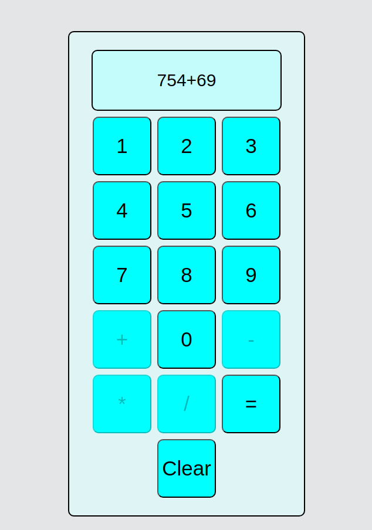

# Calculator

In this exercise i created a basic calculator that can perform addition, subtraction,
division and multiplication. 

The user clicks on the numbered buttons to input numbers and clicks on hte operator
buttons to perform the operation.

The equals operator then performs the operation and outputs the result.

The clear button removes all inputs and leaves you with an empty display.

To prevent any errors and such, when the user clicks on an operation button (example +)
the other operator buttons become grayed out and cannot be clicked.

In the future I will also add the option for floating point values, keyboard input support
and make the whole experience smoother.

Picture of the calculator:

